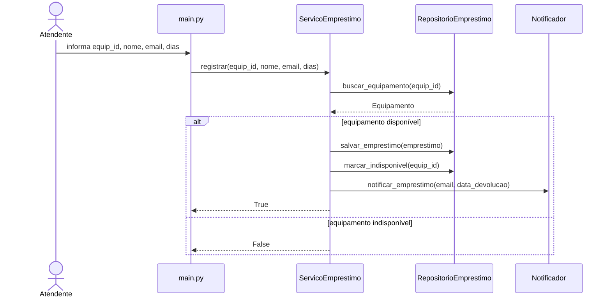
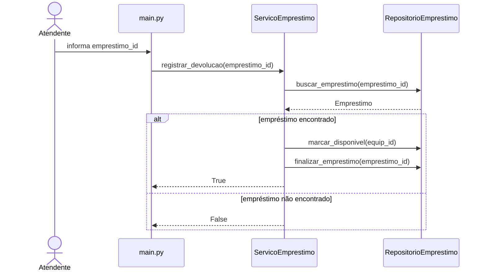

# Decomposição em camadas

## models/

### Equipamento
Representa os dados do equipamento e mantém apenas informações da entidade.

### Emprestimo
Representa os dados do empréstimo realizados no sistema.

---

## services/

### ServicoEmprestimo
Responsável pelas regras de negócio do empréstimo.

### Notificador
Responsável apenas pelo envio de notificações.

---

## repositories/

### RepositorioEmprestimo
Responsável por salvar, buscar e atualizar os dados.

---

## main.py

### main
Responsável pela interação com o atendente.

# Diagramas de sequência

## UC01 — Registrar Empréstimo



## UC02 — Registrar Devolução



## UC03 — Listar Empréstimos em Atraso

```mermaid
sequenceDiagram
    actor Atendente
    participant main as main.py
    participant servico as ServicoEmprestimo
    participant repo as RepositorioEmprestimo

    Atendente->>main: solicitar atrasados
    main->>servico: listar_atrasados()

    servico->>repo: buscar_emprestimos()
    repo-->>servico: lista_emprestimos

    loop para cada empréstimo
        servico->>servico: verificar_atraso()
    end

    servico-->>main: lista_atrasados

## Diagrama de classes — v2.0